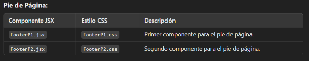

**  

**UNIVERSIDAD NACIONAL DE SAN AGUSTÍN DE AREQUIPA**

FACULTAD DE INGENIERÍA DE PRODUCCIÓN Y SERVICIOS

ESCUELA PROFESIONAL DE INGENIERÍA DE SISTEMAS
**

**PROGRAMACIÓN WEB 2**

**TEMA:** AVANCE DE PROYECTO FINAL

**DOCENTE:** ROSA YULIANA GABRIELA PACCOTACYA YANQUE

**INTEGRANTES:**   -Apaza Anahua Roydan Artemio

`                                 `-Quiñonez Delgado Aarón Fernando

`                                 `-Condori Caira Antony Beltran

`                                 `-Sencia Ale Bryan Daniel

`                                 `-Sivincha Machaca Saúl Andre

`		         `-Yauli Merma Diego Raul

**Arequipa - Perú**

**2024**
###                    **LINK DEL GITHUB :** 
### <https://github.com/SaulSivincha/CinePlanet_Proyect_PWEB2>
### **Informe de la Página Web - UnsaPlanet**
1. ### **Resumen del Proyecto**
El presente informe detalla el desarrollo de una **página web de cine**, inspirada en CinePlanet, cuyo objetivo fue ofrecer una plataforma donde los usuarios puedan consultar películas, conocer horarios, acceder a promociones y explorar productos de la dulcería.

A lo largo del proceso, se implementaron funcionalidades importantes, como la navegación entre secciones clave (cartelera, promociones, dulcería y carrito de compras) y una interfaz interactiva desarrollada con **React, Django, Bootstrap y CSS**. Sin embargo, el proyecto presenta áreas pendientes de mejora.

**Público objetivo:**

- Personas de todas las edades interesadas en acceder a información sobre cines y películas.
- Usuarios que buscan evitar filas al realizar compras de boletos y productos de manera digital.

**Resultados alcanzados:**

- Implementación de una navegación funcional entre secciones como **Cines, Películas, Promociones y Dulcería**.
- Creación de un **carrito de compras inicial** donde los usuarios pueden visualizar los productos seleccionados.
- Desarrollo de una estructura que permite futuras mejoras e integraciones.

**Limitaciones y oportunidades de mejora:**
Si bien se logró un prototipo funcional, el proyecto aún no alcanza la experiencia completa que se buscaba entregar. Aspectos como el **sistema de pagos en línea**, la autenticación de usuarios y la mejora del diseño responsivo requieren más trabajo para alcanzar los estándares deseados.

El proyecto, aunque no cumplió totalmente con nuestras expectativas, representa un avance significativo y una base sólida para implementar mejoras a futuro. El equipo ha adquirido experiencia valiosa en el desarrollo de aplicaciones web y en la colaboración durante todas las fases del proyecto.
### **Tecnologías Utilizadas**
**Frontend:**

- **React:** Desarrollo de una interfaz de usuario interactiva y dinámica mediante componentes reutilizables.
- **CSS y Bootstrap:** Diseño responsivo que garantiza una visualización óptima en dispositivos móviles y de escritorio.
- **HTML:** Estructuración de las páginas web para una navegación clara y ordenada.

**Backend:**

- **Django:** Gestión del servidor, autenticación de usuarios, manejo de la base de datos y soporte de las funcionalidades clave de la página.

**Control de Versiones:**

- **Git y GitHub:** Control de versiones del código fuente y colaboración eficiente entre los miembros del equipo de desarrollo.

**Colaboración y Comunicación:**

- **Google Meet:** Herramienta principal para la organización de reuniones, coordinación de tareas y solución de problemas en equipo durante el desarrollo del proyecto.

1. ###  **Requerimientos**
**Requerimientos funcionales:**

- **Navegación fluida:** El sitio debe permitir a los usuarios navegar de manera intuitiva entre las diferentes páginas, como la página de inicio, películas, cines, compras, promociones y productos de dulcería.
- **Compra de boletos:** Los usuarios deben poder seleccionar películas y horarios, añadir boletos al carrito y realizar compras.
- **Promociones y ofertas:** La página debe mostrar ofertas actuales y promociones, permitiendo a los usuarios aplicar descuentos al momento de la compra.
- **Integración con la base de datos:** El backend debe gestionar los datos de películas, cines, horarios, promociones y usuarios, almacenándolos y consultándolos eficientemente.
- **Interactividad:** Deben implementarse formularios para la compra de boletos y productos, además de validaciones y manejo de errores para asegurar una experiencia sin inconvenientes.

**Requerimientos técnicos:**

- **Responsividad:** La página debe ser completamente responsiva, adaptándose a pantallas de escritorio.
- **Compatibilidad con navegadores:** La página debe ser compatible con los navegadores más utilizados, como Chrome, Firefox y Safari.
- **Rendimiento:** El tiempo de carga de las páginas debe ser óptimo, optimizando las imágenes y los recursos.

**Diseño y usabilidad:**

- **Usabilidad:** La navegación debe ser intuitiva, con un diseño claro y fácil de usar. Los usuarios deben poder encontrar la información que buscan rápidamente.
- **Accesibilidad:** Se ha trabajado en la accesibilidad de la página, garantizando que los elementos sean legibles y que el sitio sea usable por personas con diferentes capacidades.
- **Estética:** Se busca un diseño moderno y atractivo que mantenga el estilo visual de una página de cine, con imágenes de alta calidad y una interfaz agradable.

1. ###  **Estructura del Proyecto**
**El proyecto se divide en dos grandes secciones:**

1. **Frontend (CinePlanet-FrontEnd):** Contiene la interfaz de usuario y los estilos **correspondientes.**
1. **Backend (CineBackend):** Proporciona la lógica del servidor y la gestión de datos.

### **Componentes del Frontend**
La carpeta src/components incluye archivos .jsx y sus respectivos archivos de estilos .css que comparten el mismo nombre:

### **Backend - CineBackend**
La estructura del **Backend** está organizada con directorios y archivos funcionales:

- El **Frontend** está construido con **React**, implementando componentes reutilizables y modulares. Cada componente cuenta con un archivo **.css** correspondiente que define su estilo visual, asegurando un diseño limpio y organizado.
- El **Backend** utiliza un framework como **Django**, organizando la lógica del servidor y almacenamiento de datos en módulos independientes (carrito, cines, dulcería, etc.).
  ### **Funcionalidades Implementadas**
1. **Carrito de Compras**
   1. Los usuarios pueden agregar boletos de cine y productos de la dulcería al carrito de compras.
   1. Se permite visualizar los artículos agregados con detalles específicos, como nombre, cantidad y precio.
   1. La funcionalidad de pago y finalización de la compra aún está en desarrollo.
1. **Gestión de Cines y Películas**
   1. Se muestran los cines disponibles con detalles específicos, como ubicación y horarios de funciones.
   1. Los usuarios pueden acceder a una vista general de las películas en cartelera y navegar entre ellas.
   1. Implementación de carruseles interactivos para destacar películas y promociones.
1. **Promociones**
   1. Las promociones activas son visibles en la página de inicio y en una sección específica.
   1. Se pueden agregar, editar y eliminar promociones desde el módulo administrativo.
   1. La integración con descuentos aplicables al carrito de compras está pendiente de desarrollo.
1. **Dulcería Virtual**
   1. Los usuarios pueden ver y seleccionar productos de la dulcería (como bebidas y snacks).
   1. Implementación de formularios para la gestión de productos en la dulcería (alta, edición y eliminación).
1. **Autenticación de Usuarios**
   1. La estructura inicial para la autenticación está implementada, permitiendo preparar el sistema para roles de usuario.
   1. La funcionalidad completa de inicio de sesión y acceso personalizado aún se encuentra en desarrollo.
1. **Administración de Contenidos**
   1. El módulo administrativo permite gestionar las secciones clave de la página:
      1. **Cines:** Creación, edición y eliminación de registros de cines.
      1. **Películas:** Administración de cartelera y detalles de cada película.
      1. **Promociones:** Gestión completa de ofertas y descuentos activos.
      1. **Dulcería:** Manejo de inventario de productos.
1. **Interfaz de Usuario Responsiva**
   1. Componentes estilizados con archivos **CSS** individuales para garantizar una interfaz limpia y organizada.
   1. Navegación sencilla con una barra principal (**NavBar**) y pies de página funcionales (**FooterP1.jsx** y **FooterP2.jsx**).
### **IV.       Screenshots**
**Página Homepage**

- Ruta: /homepage
- Muestra la página principal de la aplicación con un carrusel interactivo de películas destacadas, accesos directos a otras secciones y el diseño inicial.

  

**Página de Cines**

- Ruta: /cines
- Presenta una lista de los cines disponibles, con detalles como ubicación, horarios y acceso a la cartelera.

**Página de Películas**

- Ruta: /peliculas
- Muestra todas las películas disponibles, con sus respectivos posters, sinopsis y opciones de horarios.

  

**Página de Promociones**

- Ruta: /promociones
- Exhibe las promociones activas, con detalles de las ofertas y cómo acceder a ellas.

  

**Página de Dulcería**

- Ruta: /dulceria
- Muestra los productos disponibles en la dulcería, como snacks y bebidas, que los usuarios pueden agregar al carrito.

  

**V.     Conclusión** 

El proyecto de la página web de cine, inspirado en CinePlanet, ha sido desarrollado utilizando tecnologías como **React**, **Django**, **Bootstrap** y **CSS**. Se logró implementar funcionalidades clave, como la navegación entre secciones, la visualización de cines, películas, promociones y productos de la dulcería, así como un carrito de compras inicial.

Sin embargo, aunque el sistema está funcional, aún existen áreas que requieren mejoras y ajustes, como la integración completa con la base de datos, la implementación del sistema de pagos y el perfeccionamiento del diseño responsivo para ofrecer una experiencia óptima al usuario.

El equipo ha trabajado de manera eficiente y colaborativa durante el desarrollo, logrando un prototipo sólido que sienta las bases para futuras mejoras y funcionalidades adicionales. Este proyecto representa un avance significativo y una base sólida para su evolución y entrega final.

**VI.    EVALUACIÓN INTERNA**

|INTEGRANTES|Roydan |Antony |Aarón|DanieL|Saúl|Diego|
| :- | :- | :- | :- | :- | :- | :- |
|Apaza Anahua Roydan ||19|20|18|20|16|
|Condori Caira Antony Beltran|17||20|19|20|17|
|Quiñonez Delgado Aarón Fernando|17|18||20|20|15|
|Sencia Ale Bryan Daniel|17|18|19||18|15|
|Sivincha Machaca Saúl Andre|17|18|20|18||15|
|Yauli Merma Diego Raul|17|18|20|18|18||

Nota final : 

`  `-Apaza Anahua Roydan Artemio                           17

`  `-Condori Caira Antony Beltran                             18.2

`  `-Quiñonez Delgado Aarón Fernando                     20    

`  `-Sencia Ale Bryan Daniel                                      18.6

`  `-Sivincha Machaca Saúl Andre                             19.2

`  `-Yauli Merma Diego Raul                                     15.6
